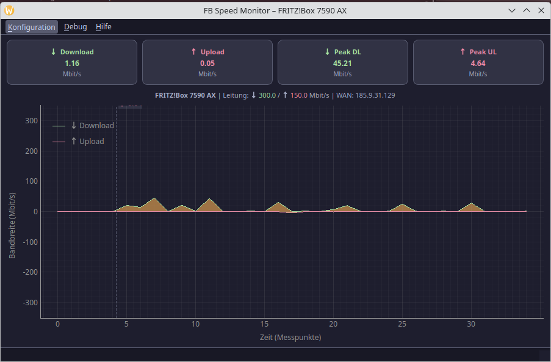

# FB Speed Monitor

Ein leichtes, eigenständiges Desktop-Tool zur Anzeige der aktuellen Upload- und Downloadraten einer FRITZ!Box – mit grafischer Darstellung in Echtzeit, entwickelt für eine einfache "Auf einen Blick"-Übersicht.



> **Dokumentation:** [Benutzerhandbuch (USER_GUIDE.md)](USER_GUIDE.md) · [Architektur & Code-Referenz (ARCHITECTURE.md)](ARCHITECTURE.md)

## Features

- **Automatische Geräteerkennung:** SSDP/UPnP-Discovery erkennt FRITZ!Box-Geräte im Netz selbständig; unterstützt über 12 Modelle mit modellspezifischen Fähigkeiten.
- **Zuverlässige Datenabfrage:** Drei unabhängige Methoden zur Bandbreitenabfrage mit automatischem Fallback für maximale Kompatibilität.
- **Saubere Daten:** Integrierte Plausibilitätsprüfung filtert Messfehler und Ausreißer.
- **Informatives Cockpit:**
    - Live-Raten für Up- und Download (Mbit/s) in vier Metric-Cards.
    - Anzeige der Leitungskapazität und Sitzungs-Spitzenwerte.
    - Modell, WAN-IP und Leitungstyp in der Infozeile.
- **Interaktiver Live-Graph:**
    - Verlauf der letzten 12 Minuten (360 Messpunkte bei 2 s Intervall).
    - Crosshair mit Tooltip zeigt exakte Werte zu jedem Zeitpunkt.
    - Fehlermeldung direkt im Graph bei Verbindungsabbruch.
- **Anpassbare Darstellung:**
    - Dunkler (Catppuccin Mocha) und heller Hintergrundmodus.
    - Zwei Kurven-Stile: *Neon-Lines* und *Gefüllte Flächen*.
    - Upload-Anzeige überlagert oder gespiegelt unter der Nulllinie.
    - Y-Achse an Leitungskapazität oder dynamisch am Spitzenwert.
    - Optionale PChip-Glättung der Kurven (erfordert scipy).
- **Benutzerfreundlich:**
    - *Immer im Vordergrund*-Modus.
    - Fensterposition wird gespeichert.
    - Windows DPI-Awareness für gestochen scharfe Darstellung auf HiDPI-Monitoren.

## Schnellstart

```bash
# Linux
python3 -m venv .venv && source .venv/bin/activate
pip install -r requirements.txt
python gui.py
```

```bat
REM Windows
python -m venv .venv && .venv\Scripts\activate
pip install -r requirements.txt
python gui.py
```

Ausführliche Installations- und Konfigurationsanleitung: [USER_GUIDE.md](USER_GUIDE.md)

## Projektstruktur

```
FB7590Trafficmonitor/
├── gui.py               # Grafische Benutzeroberfläche (PyQt5 + pyqtgraph)
├── fritzworker.py       # Hintergrund-Worker (QObject in QThread)
├── fritzreader.py       # TR-064-Kommunikation & Bandbreitenmessung
├── fritz_discovery.py   # SSDP/UPnP-Discovery & Modell-Datenbank
├── config.py            # Konfigurationsparser mit typisierten Gettern
├── config.ini           # Benutzereinstellungen (wird beim ersten Start erstellt)
├── requirements.txt     # Python-Abhängigkeiten
├── USER_GUIDE.md        # Benutzerhandbuch (englisch)
├── ARCHITECTURE.md      # Code- & Architektur-Dokumentation (englisch)
└── pic/
    └── showcase.png     # Screenshot
```

## Abhängigkeiten

| Paket | Mindestversion | Zweck |
|-------|---------------|-------|
| `PyQt5` | 5.15 | GUI-Framework |
| `pyqtgraph` | 0.13 | Live-Graph |
| `fritzconnection` | 1.12 | TR-064/UPnP-Kommunikation |
| `numpy` | 1.24 | Datenverarbeitung |
| `scipy` | 1.10 | Kurvenglättung *(optional)* |

## Voraussetzungen FRITZ!Box

UPnP und TR-064 müssen auf der FRITZ!Box aktiviert sein:
*Heimnetz → Netzwerk → Netzwerkeinstellungen → Zugriff für Anwendungen zulassen*

Das Tool greift **ausschließlich lesend** auf den Router zu – keine Einstellung wird verändert.

## Lizenz

Apache-2.0 License